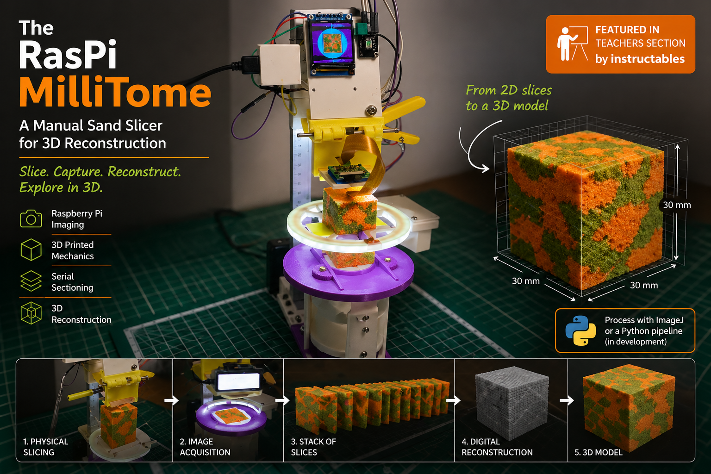

# RasPi MilliTome

Low-cost educational platform for serial sectioning and 3D reconstruction.

## Features

- Raspberry Pi image acquisition
- Serial section reconstruction
- HSV segmentation
- 3D visualization
- STL export
- Cavalieri volume estimation

## Requirements

Python 3.10+

## Installation

pip install -r requirements.txt

## Citation

Roccatano D.
The RasPi MilliTome: A Low-Cost Platform for Teaching
Three-Dimensional Reconstruction from Serial Sections.

